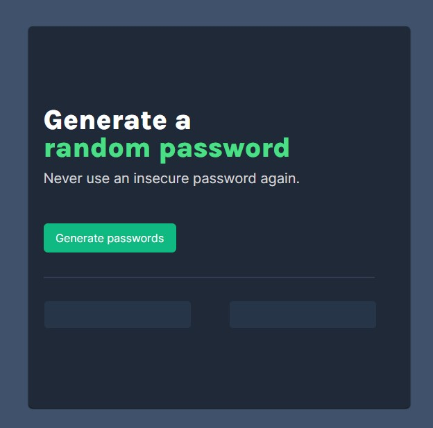

# Scoreboard Display

### Screenshot

## [live website](https://izkeer.github.io/PasswordGenerator/)
## My process

My Process to complete the solos project started by doing the visual display of the project, then adding two functions into the JS to generate a password and other to display the previous function into the desired buttons..
 

### How the project works

So, this is basicallly a password generator "app" that will generate a random password with 15 characters length (including symbols, numbers and letters).
everytime you click in the "Generate Password" button it will generate two new passwords on each element.

### Built with

- Javascript
- Semantic HTML5
- CSS

